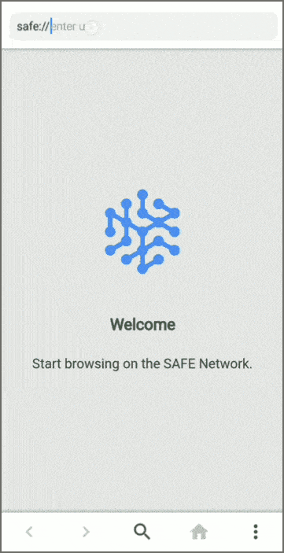

# Safe Mobile Browser

The Safe Mobile Browser is a mobile web browser for the Safe Network.

**Maintainer:** Ravinder Jangra (ravinder.jangra@maidsafe.net)

## Build Status

|CI service|Status|
|---|---|
|Azure DevOps|  |

## Table of Contents

- [Safe Mobile Browser](#safe-mobile-browser)
  - [Build Status](#build-status)
  - [Table of Contents](#table-of-contents)
  - [Overview](#overview)
  - [Features](#features)
  - [User Guide](#user-guide)
    - [Installation](#installation)
    - [Browsing Safe websites](#browsing-safe-websites)
  - [Development](#development)
    - [Project structure](#project-structure)
    - [Tools required](#tools-required)
  - [Further help](#further-help)
  - [License](#license)
  - [Contributing](#contributing)

## Overview

The Safe Mobile Browser is a cross-platform mobile (Android, iOS) browser, built to provide web browsing experience to the users on the Safe Network.

The app currently uses the [MaidSafe.SafeApp](https://www.nuget.org/packages/MaidSafe.SafeApp/) NuGet package to fetch the content from the network.

## Features

* Fetch static websites from the Safe Network.

## User Guide

### Installation

The latest version of the Safe Mobile browser can be downloaded using following links and QR code for the Android and iOS devices.

|Platform|OS & Architecture |Downlaod Link| QR Code|
|-|-|-|-|
|Android| 5.1+ (armeabi-v7a, x86_64) | [AppCenter](https://install.appcenter.ms/orgs/maidsafe-apps/apps/safe-mobile-browser/distribution_groups/community%20releases), [GitHub](https://github.com/maidsafe/sn_mobile_browser/releases) |  |
|iOS    | iOS 11+ (ARM64, x64)       | [AppCenter](https://install.appcenter.ms/orgs/MaidSafe-Apps/apps/Safe-Mobile-Browser-1) |  |

_**Note:** We use Azure App Center to distribute iOS builds. Please register [here](https://forms.gle/Svp7PU6dcf4ywmu19) so we can add you in our testing group so you can download and install the app._

### Browsing Safe websites

Once installed, mobile browser can be used to browse the websites hosted on your local or a shared network.

| Browser launch page |Fetching website from the Safe Network |
|:---:|:---:|
||  |

## Development

### Project structure

* **SafeMobileBrowser:**
  * Common UI code and Safe logic for mobile browser
* **SafeMobileBrowser.Platform:**
  * Platform: Android, iOS
  * Platform specific/dependent code
    * Custom controls for native UI
    * Platform assets
    * Platform dependent service code

### Tools required

* [Visual Studio](https://visualstudio.microsoft.com/) 2017 or later editions:
  * [Mobile development with .NET (Xamarin)](https://docs.microsoft.com/en-us/xamarin/get-started/installation/?pivots=windows)

## Further help

Get your developer related questions clarified on [Safe Dev Forum](https://forum.safedev.org/). If you're looking to share any ideas or thoughts on the SAFE Network you can reach out on [Safe Network Forum](https://safenetforum.org/)

## License

This Safe Network library is dual-licensed under the Modified BSD ([LICENSE-BSD](LICENSE-BSD) https://opensource.org/licenses/BSD-3-Clause) or the MIT license ([LICENSE-MIT](LICENSE-MIT) https://opensource.org/licenses/MIT) at your option.

## Contributing

Want to contribute? Great :tada:

There are many ways to give back to the project, whether it be writing new code, fixing bugs, or just reporting errors. All forms of contributions are encouraged!

For instructions on how to contribute, see our [Guide to contributing](https://github.com/maidsafe/QA/blob/master/CONTRIBUTING.md).
